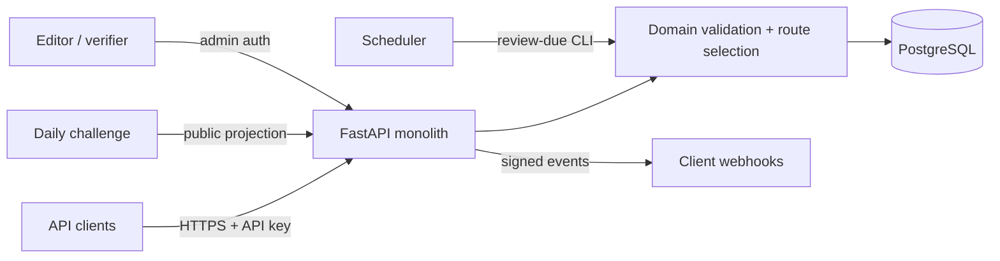

# Architecture

## Decision summary

Start with one typed Python service and one PostgreSQL database. Keep graph
traversal in the domain layer, store immutable revision documents in JSONB with
a relational identity/publication envelope, and run scheduled maintenance as a
CLI command from the same codebase.

This is a modular monolith: HTTP, editorial workflow, traversal, publication,
and webhook modules have explicit boundaries but deploy together.

## Components

### HTTP/API layer

- FastAPI routers and Pydantic input/output models
- API-key and admin authentication dependencies
- RFC 9457 problem responses
- Pagination, ETag, request ID, and rate-limit headers
- Generated OpenAPI document treated as a compatibility artifact

### Domain layer

- Graph structural and semantic validation
- Deterministic lowest-effort route selection
- Versioned friction calculation
- Draft/publication state machine
- Challenge projection that removes live URLs and private evidence

The domain layer must not import FastAPI or database session types.

### Persistence layer

- SQLAlchemy mappings and repositories
- Alembic migrations
- Relational tables for identity, variants, revisions, observations, audit
  events, clients, and webhook deliveries
- JSONB for the bounded graph document associated with an immutable revision

### Scheduled work

Use a command such as `python -m exitroute.jobs.mark_stale` under the hosting
platform's scheduler. Webhook delivery can begin in-process after transaction
commit with durable delivery rows. Add a real queue only after measurement
shows that this causes latency or reliability failures.

## Core request path

1. Normalize service slug, ISO region, platform, and outcome.
2. Select the current published route variant.
3. Evaluate freshness; do not silently label overdue data verified.
4. Load the immutable revision payload.
5. Return its precomputed best route and friction metrics with an ETag based on
   the revision fingerprint.
6. Emit an audit/usage event without personal request contents.

Best routes and friction are computed and validated on publication, not on
every read. A runtime recomputation in tests guards against stored-result drift.

## Deployment shape

Initial environments:

- Local: application process plus PostgreSQL container
- CI: isolated PostgreSQL service per job
- Staging: one application instance and managed PostgreSQL
- Production pilot: at least two application instances and managed PostgreSQL

Hosting is deliberately undecided until the pilot reveals traffic, region, and
operational constraints. The container and environment contract should remain
provider-neutral.

## Security and privacy boundaries

- Never accept service credentials, session cookies, member IDs, payment data,
  or free-form account narratives.
- Observation payloads use enumerated semantic change types and bounded text.
- Store API keys as slow hashes or keyed digests; show plaintext only once.
- Separate admin identity from API-client identity and audit all publication actions.
- Sign webhooks, include timestamps, and reject replays outside a bounded window.
- Apply database least privilege and keep backups encrypted.
- Do not place raw screenshots in the MVP. If later required, design a separate
  quarantine, redaction, retention, and access-control system first.

## Scaling triggers—not guesses

Add infrastructure only when a measured trigger occurs:

| Addition | Trigger |
|---|---|
| Redis cache | PostgreSQL-backed reads miss the latency objective under representative load |
| Worker queue | webhook/scheduled work causes request latency or lost work despite durable rows |
| Object storage | approved evidence policy requires media and legal/privacy review is complete |
| Search service | service discovery cannot meet relevance/latency goals with PostgreSQL indexes |
| Separate services | teams or failure domains cannot deploy safely as one unit |
| Graph database | required graph queries exceed bounded per-revision traversal and PostgreSQL evidence proves the bottleneck |

## Architecture evidence

FastAPI documents native OpenAPI/JSON Schema generation and typed nested-model
validation. PostgreSQL documents JSONB operators and GIN indexing. Those
capabilities support this plan; they do not prove product demand or data
freshness, which are handled by separate pilot gates.

- [FastAPI features](https://fastapi.tiangolo.com/features/)
- [PostgreSQL JSONB types and indexing](https://www.postgresql.org/docs/current/datatype-json.html)
- [OpenAPI Specification](https://spec.openapis.org/oas/latest.html)
- [RFC 9457](https://www.rfc-editor.org/rfc/rfc9457.html)
