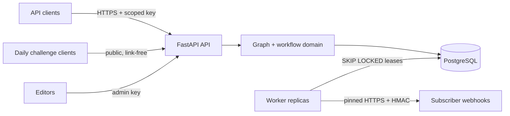

# Architecture

ExitRoute is a provider-neutral modular monolith: one typed application package,
one PostgreSQL database, and two process roles built from the same immutable
container. The API serves requests; the worker enforces freshness and drains a
transactional webhook outbox.

## Boundaries

The `domain` package has no HTTP or database imports. It owns graph structure,
semantic edge rules, deterministic Dijkstra selection, friction scoring,
canonical fingerprints, ETags, cursor signatures, credential digests, and
webhook network validation.

The `services` package owns transactions and state changes. Publication locks
the logical route, verifies two independent sessions, supersedes the old
revision, changes the current pointer, appends change/audit events, and creates
all matching webhook deliveries in one commit.

The `api` package translates typed requests into service calls and returns RFC
9457-style problem documents with stable machine codes. Request bodies, query
parameters, headers, and responses generate the canonical OpenAPI document.

Alembic owns schema evolution. PostgreSQL checks reject invalid envelopes;
triggers prevent updates to published content and any update/delete of audit or
change events. Integration tests exercise these database controls directly.

## Core paths

### Read

1. Authenticate a keyed digest and atomically consume the client's minute window.
2. Find the active service variant and its current published revision.
3. Mark an overdue verified revision stale before representing it.
4. Build an ETag from content fingerprint plus publication/trust status version.
5. Return `304` on a matching `If-None-Match`; otherwise return the immutable graph.

### Publish

1. Lock the draft and logical route.
2. Require two passed sessions with distinct verifier and environment identities.
3. Validate the configured review window.
4. Supersede the previous revision without changing its content.
5. Publish the draft, update the current pointer, append audit/change records,
   and create webhook outbox rows atomically.

### Deliver

1. Worker replicas lease due rows with `FOR UPDATE SKIP LOCKED` and an expiry.
2. Resolve the hostname again and reject any non-global result.
3. Connect to one vetted IP, retain the original hostname for HTTP Host and TLS SNI,
   disable redirects and environment proxies, and sign the exact canonical body.
4. Mark 2xx delivered, permanent 4xx dead, or bounded exponential retries for
   network errors, 408/425/429, and 5xx responses.

## Deployment model

The container runs as UID/GID 10001, has no Linux capabilities, supports a
read-only root filesystem, and writes only to PostgreSQL. Compose provides a
development topology. Production operators should use redundant API and worker
replicas, managed PostgreSQL or equivalent backup/replication, a TLS ingress,
central log collection, and secret injection supplied by their platform.

No API process performs migrations at startup. A separate, idempotent migration
job must succeed before new application instances become ready.

## Scaling triggers

Do not split the system on anticipation alone.

| Addition | Evidence required |
|---|---|
| Redis/cache tier | PostgreSQL read path misses the latency objective after indexing and HTTP cache validation |
| Dedicated queue | The transactional outbox cannot meet measured delivery lag or database load objectives |
| Object storage | A reviewed evidence policy explicitly permits media, with quarantine and deletion controls |
| Search service | Indexed PostgreSQL discovery misses a measured relevance or latency need |
| Separate services | Independent teams or failure domains cannot deploy safely from the monolith |
| Graph database | Bounded in-revision traversal is proven to be the bottleneck by production profiles |
